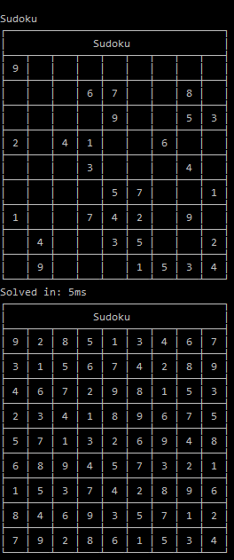

# Pazuru
Pazuru, a platform to please enigmatologists. :^)

## Pazuru.Sudoku
Can solve, create and store standard sudoku puzzles.

### Pazuru.Presentation.Web.FrontEnd
Uses websockets to update the current puzzlestate.

### Pazuru.Presentation.CLI
Uses DancingLinks and Backtracking to generate and solve puzzles. 
